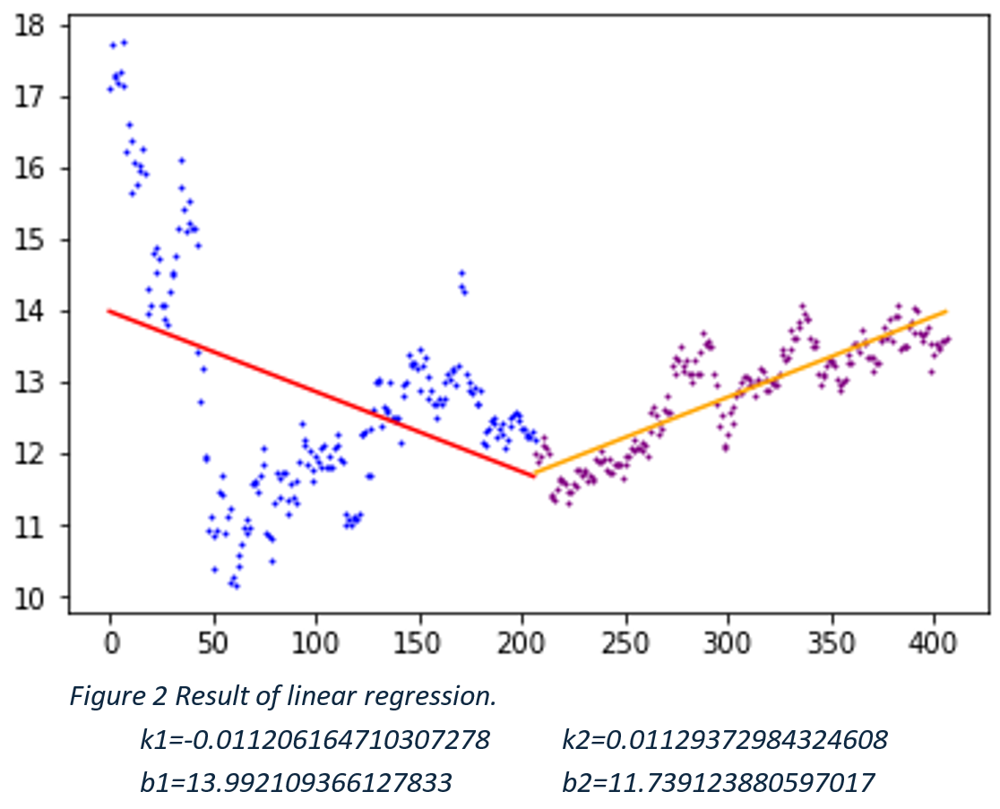

# Code

For data processing, the data are seperated into pre-event and post-event parts. Only open value is picked.

For data analysis, linear regressions are done seperately. The package "sklearn" is applied. Then each set of raw data and regression result are ploted to estimate the performance. Finally the results of the regression for two sets are combined to compare.

