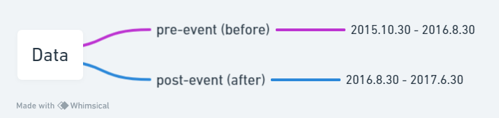

# Data

Considering the time required for a child to be born, and avoiding the overall environmental turbulence in China (such as the 2018 financial crisis), the data is divided into pre-event (2015.10.30 - 2016.8.30) and post-event (2016.8.30 - 2017.6.30) categories. All data is time-series, with frequency of pre trading day.

| Variable | Description | Frequency | Unit | Type | Range |
|--------------|--------------|--------------|--------------|--------------|--------------|
| pre-event_stock_value | the value of stock of Beingmate before the Two-child policy | per trading day | RMB | float | 2015.10.30 - 2016.8.30 |
| post-event_stock_value | the value of stock of Beingmate after the Two-child policy | per trading day | RMB | float | 2016.8.30 - 2017.6.30 |
