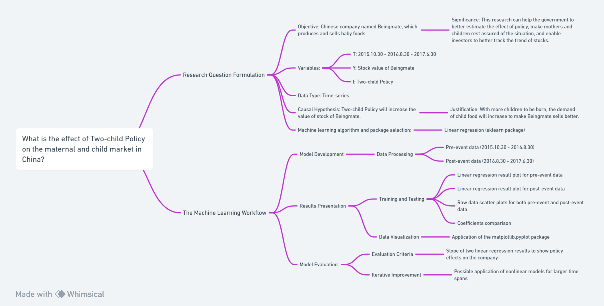

# What is the effect of Two-child Policy on the maternal and child market in China?

## Research Question Formulation

Objective: Chinese company named Beingmate, which produces and sells baby foods

Significance: This research can help the government to better estimate the effect of policy, make mothers and children rest assured of the situation, and enable investors to better track the trend of stocks.

## Operational Measures

Variables:

T: 2015.10.30 - 2016.8.30 - 2017.6.30

Y: Stock value of Beingmate

I: Two-child Policy

Data Type: Time-series

## Hypothesis Development

Causal Hypothesis: Two-child Policy will increase the value of stock of Beingmate.

Justification: With more children to be born, the demand of child food will increase to make Beingmate sells better.

Machine learning algorithm and package selection: Linear regression (sklearn package)

## The Machine Learning Workflow

### Model Development

Data Processing: Considering the time required for a child to be born, and avoiding the overall environmental turbulence in China (such as the 2018 financial crisis), the data is divided into pre-event (2015.10.30 - 2016.8.30) and post-event (2016.8.30 - 2017.6.30) categories

### Results Presentation

Training and Testing: For both pre-event and post-event data, the linear regression result will be ploted and raw data will be scatter ploted. Also the coefficients will be printed and compared.

Data Visualization: The matplotlib.pyplot package will be applied.

### Model Evaluation:

Evaluation Criteria: The slope of two linear regression result will show whether the policy affects the company.

Iterative Improvement: Maybe nonlinear models can be applied for larger time span. 

