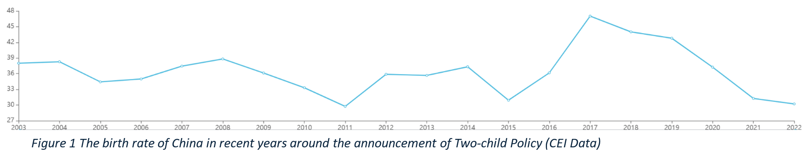

Zhaxt_Stats201_TwoChildPolicy

# What is the effect of Two-child Policy on the maternal and child market in China?

Since the announcement of the Two-child Policy on October 30, 2015 in China, the population is expected to be in a different situation before and after 2016. However, there is meant to be more areas influneced by this policy, such as the stock market.

In this project, the effect of this policy is estimated from the stock value of Beingmate, a company that produces and sells baby foods. This project is likely to help the government to better estimate the effect of policy, make mothers and children rest assured of the situation, and enable investors to better track the trend of stocks.

# Table of Contents
- [Method](/Method)
- [Data](/Data)
  - [Processed_data](/Data/processed_data)
  - [Queried_data](/Data/queried_data)
- [Code](/Code)
  - [Data_query](/Code/data_query)
  - [Data_anaylsis](/Code/data_anaylsis)
- [Results](/Results)
- [Future Research Directions](/Future_Research_Directions)
- [Spotlights](/Spotlights)

# Reference
CEI Data. (2024). https://wap.ceidata.cei.cn/detail?id=wtk%2BC6zf8F0%3D
Liu, J., Song, L., Qiu, J., Jing, W., Wang, L., Dai, Y., ... & Liu, M. (2020). Reducing maternal mortality in China in the era of the two-child policy. BMJ global health, 5(2), e002157. https://doi.org/10.1016/S0140-6736(16)31405-2

# About the author

Organization: Duke Kunshan University

Major: Applied Math

Course: Stats201
