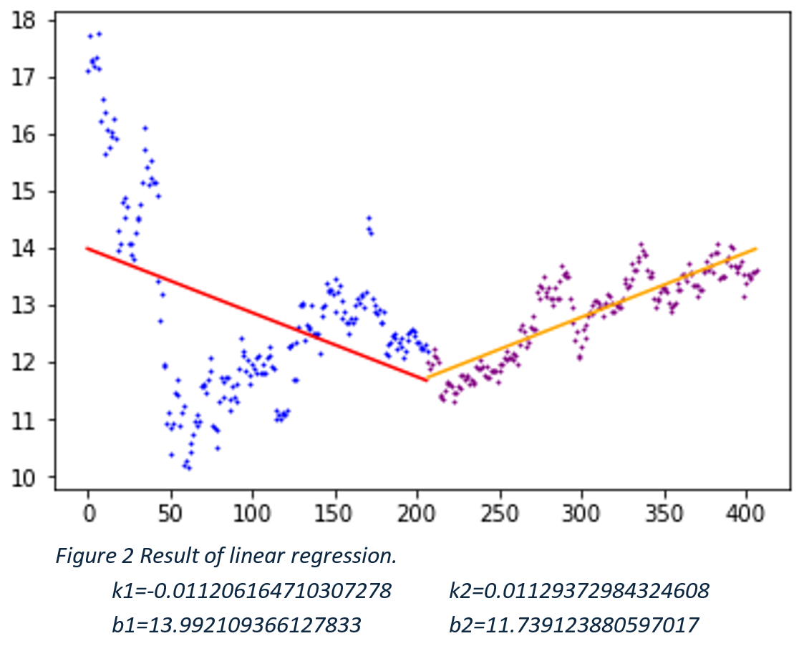

# Results

It is observed in Figure 1 that there is a huge increase in birth rate in China at the end of 2016 and the start of 2017. Considering the time required for a child to be born, “2016.8.30” is selected as the event time. Then avoid some overall environmental turbulence in China (such as the 2018 financial crisis), and the full data is devided into pre-event (2015.10.30 - 2016.8.30) and post-event (2016.8.30 - 2017.6.30) categories.

After the regression, the slope (k1, k2) and intercept (b1, b2) are presented. Comparison between slopes can show the change of trend caused by the event, and the continuity is also tested.

From Figure 2, the Two-child Policy do promote the development of the maternal and child market. Also since there is no discontinuity, this policy was conducted mildly.
